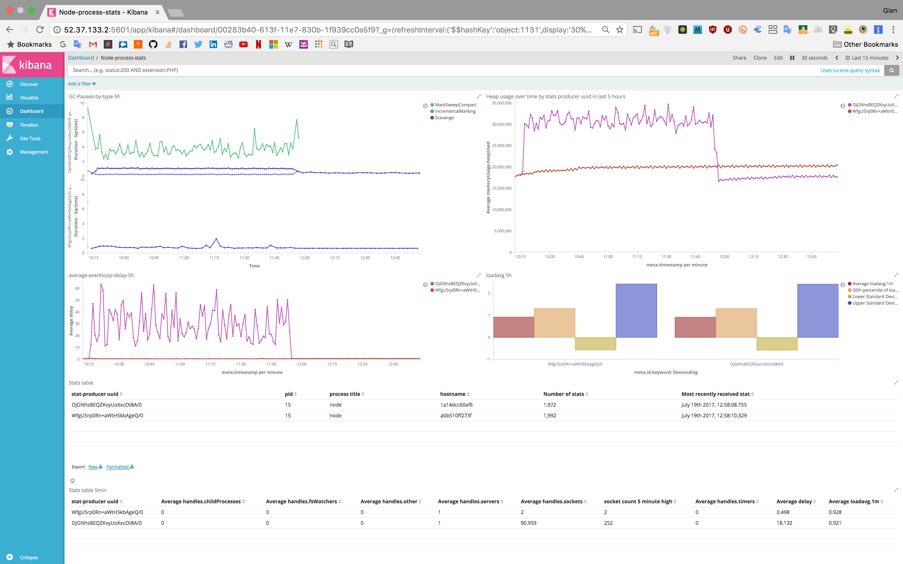

# stats

[](https://travis-ci.org/nearform/stats)

Collect stats about your node.js process.

## Intro to the nearform stats tooling

Created with the purpose to make creating visualisations about your process easy. At nearform, we achieve this using the modules [stats](http://github.com/nearform/stats) [stats-to-elasticsearch](http://github.com/nearform/stats-to-elasticsearch) and [create-stats-dashboard](http://github.com/nearform/create-stats-dashboard). This makes it very easy to collect process stats in elasticsearch and visualise them in a dashboard in kibana, similar to that below:



Once your dashboard is setup with create-stats-dashboard, all you should need to do is require the stats-to-elasticsearch module and point it at the dashboard to get cool (and useful) visualisations!

## Installation

```
npm install -save @nearform/stats
```

### Usage

This module exports a function which instantiates an event emitter which emits a single event, `stats`. This event emitter has two functions which can be used to start and stop probing for statistics, `start()` and `stop()`. Listen to the `stats` event to get useful process statistics.

### Example:
```js
const StatsProducer = require('@nearform/stats')
const statsProducer = new StatsProducer()
statsProducer.start()
statsProducer.on('stats', function (stats) {
  // so something with these stats
})

// some time later...
statsProducer.stop()
```

### API

`StatsProducer(opts)`

Returns an event emitter which emits a `stats` event containing useful stats.

- opts: an `object` which can contain the following properties to set for generating statistics
  - sampleInterval: a `number` representing the amount of seconds to take a sample when running. Defaults to 5 seconds.
  - eventLoopSampleInterval: the interval at which the eventLoop should be sampled, defaults to 500.
  - eventLoopLimit: the maximum amount of delay that is tolerated before overLimit is detected as true, defaults to 50.

The StatsProducer event emitter which is returned has the following methods.

`statsProducer.start()` - starts the stats producer listening and producing stats.

`statsProducer.stop()` - stops producing stats.

### Stat object

The stat object which is emitted has the following properties:

- `id`: A uuid generated at start up for this stats producer
- `timestamp`: The time the stats were generated
- `process`: an object with the following properties extracted from the global process object. See the official node documentation for more information on these properties.
  - `cpuUsage`: This is a function on the process object which is invoked to fill in the value.
  - `memoryUsage`: This is a function on the process object which is invoked to fill in the value.
  - `uptime`: This is a function on the process object which is invoked to fill in the value.
  - `title`
  - `pid`
  - `release`
  - `versions`
  - `argv`
  - `execArgv`
  - `execPath`
- `system`: an object with the following properties extracted from the os module. See the official node documentation for more information on these properties.
  - `cpus`: This is a function on the os module which is invoked at initialisation to fill in the value. This is not expected to change.
  - `uptime`:  This is a function on the os module which is invoked to fill in the value.
  - `freemem`: This is a function on the os module which is invoked to fill in the value.
  - `loadavg`: This is a function on the os module which is invoked to fill in the value.
  - `platform`
  - `arch`
- `eventLoop`: this is an object which contains the following properties extracted from benchmarking the eventloop.
  - `delay`: The delay in milliseconds (and fractions) from the expected eventloop run. It might be negative (in older nodes).
  - `limit`: The maximum amount of delay that is tolerated before overLimit becomes true.
  - `overlimit`: true if the delay > limit.
- `gcRuns`: an array with objects added after every gc run. see [here](http://npm.im/gc-profiler) to see the format of the objects added

## Useful links

- [stats](http://github.com/nearform/stats) - makes generating the stats to be visualised a breeze!
- [stats-to-elasticsearch](http://github.com/nearform/stats-to-elasticsearch) - makes sending the stats to es a breeze!
- [create-stats-dashboard](http://github.com/nearform/create-stats-dashboard) - makes creating your kibana dashboard a breeze!

### License

Apache 2.0
